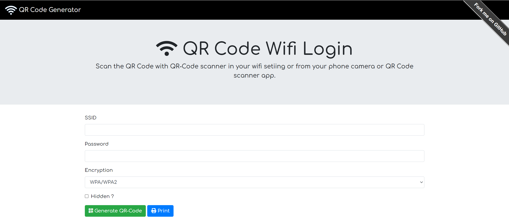

# A vanilla javascript QR-Code Generator for your home wifi network.

## Scenario

This is a sample QR-Code Generator for home Wifi Networks. Use this sample to generate a QR-Code for your Home wifi and ask your guests to just scan the QR-Code with their phone camera or a suitable QR-Scanner on their mobile phones and get connected to the wifi seamlesslessly.

### Step 1: Download node.js for your platform

To successfully use this sample, you need a working installation of Node.js.

### Step 2: Install NPM modules

Next, install the NPM packages.

From your shell or command line:
* `$ npm install`

### Step 8: Run the sample

1. To locally run the sample, you can use `npm run start`.
2. To run this sample in developement mode use `npm run start-dev`.

## Notes about the code.
This sample uses `qrcode.min.js` to create the QR Codes using pure Javascript.